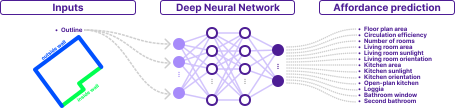

# Neufert 4.0 Project


*Figure 1: Generative AI for residential design in action

# Project Description
The "Neufert 4.0" project adapts innovative methods of artificial intelligence to derive design heuristics from an extensive database of existing apartment floor plans. The aim is to provide architects and planners with tools that efficiently support the design of residential buildings that are suitable for use. The basis of the project is a comprehensive collection of approx. 35,000 apartment floor plans. These floor plans contain not only geometric data, but also detailed semantic information on the individual components, room types and the urban environment. In addition, experience and use - related aspects such as daylight, visual relationships and spatial contexts are taken into account. 

Through the use of machine learning methods, this project identifies relationships between the spatial configuration, the urban context and user-centered qualities. Different approaches to machine learning are evaluated to find out which methods are particularly suitable for generating design heuristics. In addition, visualization techniques are developed to present these complex relationships in a way that architects and other professionals can understand. The practicality of the developed methods was tested in workshops in which the methods were applied in real design scenarios. 

The use case focuses on the floor plan design of an apartment, with the apartment outline and the entrance door position serving as input. Four design heuristics have been developed for this purpose: First, the search for similar floor plans makes it possible to search for similar boundary conditions in a database in order to find proven room concepts. Secondly, outline affordance allows  to assess the most probable qualities that are achievable with the given outline. Thirdly, the creation of room diagrams visualises how rooms can be sensibly positioned in relation to each other in order to meet the requirements. Finally, the generation of the floor plan geometry supports  the concrete positioning of walls, doors and windows in order to achieve a functional and high-quality room layout. 

The methodology developed in the project offers valuable insights into the use of artificial intelligence in the architectural design process and at the same time opens up new perspectives in housing research. 

### Funding Agency:
Federal Institute for Research on Building, Urban Affairs and Spatial Development (BBSR) on behalf of the German Federal Ministry for Housing, Urban Development, and Building (BMWSB)
### Duration: 
April 2022 - November 2024
### Team:
Bauhaus University Weimar: Dr. Sven Schneider, Dr. Martin Bielik, Luyang Zhang, Dr. Milan Valášek 

Archilyse AG: Dr. Matthias Standfest, Michael Franzen


**Key Project Resources**:
- [Link to Full Report](#)
- **FloorAI Platform**: An interactive tool that allows users to explore the project's outputs.

## Dataset
The dataset, provided by Archilyse AG, contains geometric and semantic information about 35,000 apartments. A data-cleaning procedure was carried out to ensure consistency and quality, involving the exclusion of apartments with incomplete or inaccurate data.

[](https://doi.org/10.5281/zenodo.14223942)

## Codebase
The entire codebase for the project is available on GitHub:
- [Bauhaus-InfAU/Neufert4.0](https://github.com/Bauhaus-InfAU/Neufert4.0)

# Design Heuristic A - Affordance Prediction
**Goals**: Assess the potential residential quality of a given outline to support architects in the early design phase. Specifically, the heuristic aims to predict qualities such as daylight availability, spatial relationships, and overall usability based on the geometry of the floor plan.



*Figure 2: Inputs and Outputs for the Affordance Design Heuristic*

**Method**: A Convolutional Neural Network (CNN) architecture was used to train models on the geometric and semantic features of floor plans. The model architecture included multiple convolutional layers to extract spatial features, followed by fully connected layers to make predictions on residential qualities. The training process involved supervised learning, using labeled data with predefined residential quality metrics. Transfer learning was also applied to leverage pre-trained models for better generalization.

**Results & Conclusion**:
- The heuristic effectively predicts qualities such as daylight availability and spatial relationships.
- Users found the heuristic helpful for identifying early-stage optimization opportunities.

# Design Heuristic B - Search
**Goals**: Enable architects to efficiently find similar existing floor plans that match a given outline. The aim is to provide a reference for proven spatial concepts that can guide the design process.

**Method**: To address the limitations of previous approaches, we adapted our methodology. Instead of using graph embeddings, we computed Hu's moment invariants for each floor plan polygon [Hu, 1962]. These seven real numbers, derived from image moments, are commonly used in pattern recognition for their invariance to translation, scaling, and, except for the sign of the last invariant, reflection. Using a simple log transformation:

```
𝐻𝑖 = −𝑠𝑖𝑔𝑛(ℎ𝑖) ∗ 𝑙𝑜𝑔10|ℎ𝑖|,
```

where \( h_i \) is the i-th moment invariant, allowed us to place these moment invariants on a similar scale, enabling the use of an unweighted distance (typically Manhattan distance) in the resulting 7-dimensional space to calculate shape similarity.

**Results & Conclusion**:
- **Strengths**: Quickly finds reference layouts, providing proven spatial concepts.
- **Limitations**: Limited to existing database variations.
- **User Feedback**:
  - Placing the selected floor plan in Rhino.
  - Closing FloorAI and zooming in on the chosen layout.

# Design Heuristic C - Generate
**Goals**: Generate new floor plan designs by adjusting key spatial parameters. This heuristic aims to support creative exploration by providing architects with multiple layout options based on user-defined constraints.

**Method**: A diffusion-based generative model was employed to suggest new layouts. The model first generates a room layout, which is then refined to include walls, doors, and windows. The architecture of the generative model includes an initial noise-based diffusion process, followed by a denoising step that produces the final layout. The model was trained on the cleaned dataset of 35,000 floor plans, with conditioning on key parameters such as the number of rooms, room sizes, and connectivity requirements.

**Results & Conclusion**:
- **Strengths**: Flexibility to modify parameters like the number of rooms.
- **Limitations**: Generated layouts may still need manual adjustment for nuanced requirements.
- **User Feedback**:
  - Selecting two floor plans and modifying the number of rooms.
  - Placing the selected floor plans in Rhino, zooming in, and closing FloorAI.
